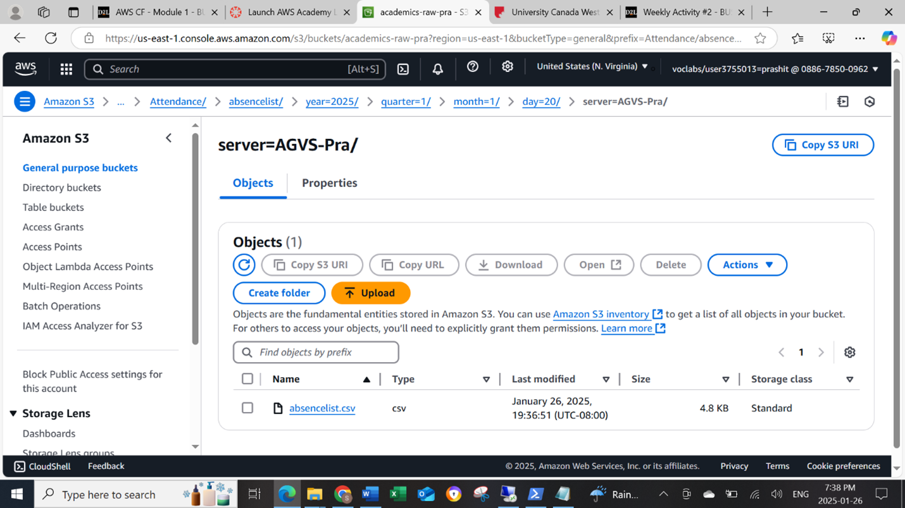
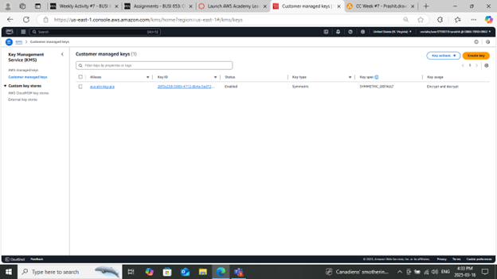

# data-analyst-prashit
# Data Wrangling and Data Quality Check  
## Data Wrangling Initiative at UCW for Attendance  

### Objective  
The primary objective of this project is to develop a Data Wrangling Framework at UCW in the overall DAP architecture operated by UCW admissions team for attendance procedure. This framework will streamline data ingestion, transformation, and preparation for analysis, improving efficiency and accuracy in decision-making regarding the attendance procedure of UCW.  

### Background  
As UCW scales its attendance, the data is being stored in the Amazon virtual server. Through the use of AWS, UCW plans to transfer its data from its local server to the cloud and wants a cleaned data set that can be analyzed and updated on a regular basis. The system also automates these processes.  

### Scope  
The project covers:  
- **Data Ingestion:** Extracting raw UCW attendance data and ingesting it into S3 buckets.  
- **Data Cleaning:** Making changes to the data to clean it, such as handling missing values, removing duplicates, and standardizing formats.  
- **Data Transformation:** Making it ready for analysis by structuring data into an analysis-ready format.  
- **Data Integration:** Merging data from different sources into a unified dataset.  

### Methodology  
1. **Data Collection & Ingestion**  
   - Data was stored in a friendly format. CSV file was used for users and Parquet file was used for the system. The data was ingested by using a remote desktop created from the instance.  
   - Automated data system by updating data at the desired time.  
2. **Data Cleaning & Preprocessing**  
   - Cleaning activities were performed, such as handling missing values, changing column names, and separating columns.  
   - Uniqueness and completeness were checked.  
   - Standardized data formats: CSV for users and Parquet with Snappy compression for the system.  
3. **Data Transformation**  
   - Data transformation was done through aggregating, making changes in schema, etc.  
   - Raw data was converted into structured formats ready for analysis.  
4. **Data Integration**  
   - Merged multiple datasets into a consolidated format by using a shared column.  
   - Inconsistencies were removed from the data.  

### Tools & Technologies  
- **AWS S3**  
- **EC2**  
- **AWS Glue DataBrew**  
- **AWS Glue (Crawler, Tables, Data Catalog)**  
- **AWS Athena**  

### Deliverables  
- Automated Data Wrangling Pipeline  
- Cleaned and Transformed Datasets  
- Data Integration Framework  
- Validation Reports and Logs  

### Timeline  
**4 weeks**  

### Screenshots

---  

## Data Quality Control for UCW Attendance Procedure  

### Objective  
The primary objective of this project is to establish a comprehensive Data Quality Control (DQC) framework at UCW for the attendance dataset. The framework is created to have a quality dataset with accurate, complete, secure, and reliable data.  

### Background  
As UCW wants to store its attendance dataset in the cloud and analyze it through the cloud, it is important to have a proper dataset for analysis and security.  

### Scope  
The project focuses on the following key areas:  
- **Data Integrity:** Implementing rules to ensure data integrity. A key was created and implemented with bucket versioning enabled.  
- **Monitoring and Reporting:** Establishing dashboards to track data quality metrics. An additional alarm notification system was enabled.  

### Methodology  
1. **Validation Rules and Procedures**  
   - Lifecycle rules, encryption with key created through KMS.  
2. **Monitoring and Reporting**  
   - Using an EC2 instance, user logs were created, which store user logs for data trail and security.  
   - Implementation of real-time dashboards to track data quality metrics using AWS CloudWatch.  

### Tools & Technologies  
- **AWS Glue (Visual ETL)**  
- **AWS CloudWatch**  
- **AWS CloudTrail**  
- **KMS (IAM, Key)**  
- **SNS**  

### Deliverables  
- Comprehensive Data Quality Control  
- Cleaned and Encrypted Datasets  
- Monitoring Dashboards for Real-Time Insights  
- Notification for Alarm  

### Timeline  
**4 weeks**  
## Screenshots

